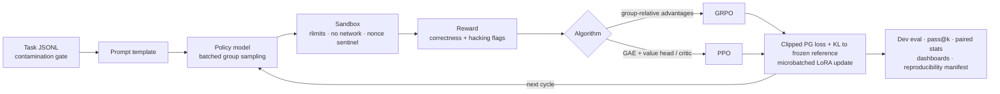

# CodeSelf

[](https://github.com/harsit14/CodeSelf/actions/workflows/ci.yml)

[](./LICENSE)

**Execution-feedback reinforcement learning for code models.** CodeSelf samples
Python solutions from a language model, runs them against unit tests in a
hardened sandbox, turns the outcomes into rewards, and fine-tunes the model with
GRPO or PPO. It then measures whether the model actually got better, using
held-out tasks and paired statistics.

> **Research question.** Can a small code model measurably improve on a fixed
> task distribution by practicing against real tests, and which RL algorithm
> makes better use of sparse, test-based rewards?

The whole pipeline is built from first principles in plain PyTorch +
Transformers + PEFT: losses, advantage estimation, rollout collection, sandbox,
reward checks, and evaluation statistics. It does not wrap an off-the-shelf RL
trainer.

---

## TL;DR

- **End-to-end RL loop on a real model.** Online *collect → execute → score →
  optimize* cycles with LoRA on `Qwen3-0.6B-Base`, running on a single laptop
  GPU (Apple Silicon / MPS).
- **GRPO improved the model; PPO did not under the same budget.** In the debug
  run, GRPO roughly doubled the training pass rate, while PPO stayed stable but
  flat. A plausible cause is PPO's cold critic under sparse terminal rewards (see
  [Results](#results)).
- **The reward is treated as an attack surface.** The sandbox blocks 22
  scripted escape and cheating attempts. An AST-based detector flags
  reward-hacking solutions (constant returns, lookup tables keyed on test
  inputs, hardcoded test answers).
- **Evaluation built for real claims.** Unbiased pass@k, exact McNemar tests,
  paired bootstrap confidence intervals, permutation tests, and power analysis
  over paired task outcomes.
- **~18.6k lines of typed Python and ~8.9k lines of tests** (260 unit tests).
  The core runs with **zero third-party dependencies**, so CI exercises the full
  pipeline in seconds.

---

## Results

### Debug-scale training run

`Qwen3-0.6B-Base` + LoRA, 15 online training cycles on the bundled
`codeself-debug` distribution (8 train / 2 dev tasks), single Apple-Silicon
device, single seed. Values are start → end of training.

| Algorithm | Train reward | Train pass rate | Dev reward | Dev pass@1 |
| --- | ---: | ---: | ---: | ---: |
| **GRPO** | 0.33 → **0.74** | 38% → **66%** | 0.72 → **0.84** | 75% → **88%** |
| PPO | 0.38 → 0.26 | 44% → 30% | 0.49 → 0.46 | 50% → 50% |

**Takeaways**

1. **GRPO learns from test rewards with very little data.** The group-relative
   baseline (several samples per prompt, each scored against the group mean)
   gives a usable advantage signal with no value model.
2. **PPO is stable but does not improve here.** Gradient norms stay finite, the
   value loss decreases, and nothing collapses, yet the policy does not move in
   a useful direction. My working hypothesis: with one terminal reward per
   completion and small batches, a freshly initialized critic cannot produce
   accurate advantages within 15 cycles. A warmed-up critic or larger batches
   would test this (see [Next steps](#next-steps)).
3. **The scale of these numbers matters.** This dev split has only two tasks
   and one seed, so these numbers show that the pipeline learns. They are not a
   benchmark result. The evaluation tooling below exists so that a scaled-up
   run can make claims with confidence intervals.

### Reproducible smoke check (no GPU, no dependencies)

The following commands reproduce these numbers exactly. The same pipeline runs
in CI.

```bash
python3 scripts/run_rollouts.py --tasks configs/datasets/tasks.example.jsonl \
  --output outputs/rollouts/smoke.jsonl --backend mock --samples-per-task 4 \
  --seed 20260601 --skip-data-quality-checks
python3 scripts/evaluate_rollouts.py --rollouts outputs/rollouts/smoke.jsonl \
  --output outputs/reports/smoke_eval.md --ks 1,2,4
```

| Rollouts | Pass rate | Mean reward | Parse failures | pass@1 | pass@2 | pass@4 |
| ---: | ---: | ---: | ---: | ---: | ---: | ---: |
| 4 | 75% | 0.85 | 0% | 75% | 100% | 100% |

---

## Engineering highlights

Most of the hard problems were bugs that small-scale tests had hidden. Each fix
below has a regression test.

| Problem found | Why it mattered | Fix |
| --- | --- | --- |
| The static security scanner rejected idiomatic Python (`str.replace`, `list.remove`, `getattr`) | Correct solutions got reward **−1.0**, which silently poisoned the RL signal | Rewrote the scanner to block only genuinely dangerous surfaces; added tests that idiomatic solutions pass end to end |
| Candidate code could read the test harness from disk, or call `os._exit(0)` to fake a pass | A policy optimizing reward would eventually find these exploits | Test code is sent over stdin and never written to disk. A per-run **nonce sentinel** must be printed for a pass to count. [22 adversarial tests](./tests/unit/test_sandbox_adversarial.py) cover fork bombs, memory bombs, sockets, `io.FileIO`, forged sentinels, and more |
| Out-of-memory errors on a real model | A full-vocabulary `log_softmax` over Qwen's ~150k-token vocabulary, plus one backward pass over the whole group, exceeded device memory | Gather token log probabilities with `logsumexp`, and microbatch forward + backward. A [unit test](./tests/unit/test_grpo_loop.py) shows the microbatched update **matches the full-batch update** |
| NaNs in PPO | The fp16 value head overflowed | Switched the value head to bf16 and added a defensive logits sanitizer |
| Reward hacking | Tests can be passed without solving the task | [AST detector](./src/codeself/rewards/reward_hacking.py) for constant functions, lookup tables keyed on visible-test inputs, hardcoded expected outputs, and degenerate or repeated output; 0% false positives on real rollouts |
| Benchmark contamination | Leaked hidden tests inflate pass rates | Versioned dataset configs with a **hard contamination gate** (`DatasetContaminationError`) and a hidden-test leak detector |

The [development log](./blog/) records the reasoning behind each of these
milestones in detail.

---

## How it works



**GRPO objective.** For each prompt, sample *G* completions, score each one with
the tests, and use `(r − mean) / std` within the group as the advantage. The
loss is a PPO-style clipped surrogate over response tokens only, plus a k3 KL
estimator (`exp(Δ) − Δ − 1`) against a frozen reference policy.
([`grpo_torch.py`](./src/codeself/training/grpo_torch.py))

**PPO baseline.** Uses either a value head on the shared backbone or a separate
critic model, with GAE and a clipped value loss. It uses the same rollout budget,
prompts, reward version, and evaluation protocol as GRPO, so the comparison is
fair. ([`ppo_torch.py`](./src/codeself/training/ppo_torch.py))

**Self-debug mode.** The model sees its own failing public-test output and
submits a revision. Shaping for the reward on revisions is configurable, and
single-shot vs. self-debug ablation configs are included.

**Sandbox.** An AST security scan runs first. Execution then happens in an
isolated subprocess with CPU, memory, file, and process limits, network
blocking, and per-phase isolation (syntax → import → public tests → hidden
tests). On macOS, where `RLIMIT_AS` is not enforced, a parent-side RSS watchdog
takes its place. A Docker runner is available for stricter final evaluation.

### Repository layout

| Path | Purpose |
| --- | --- |
| [`src/codeself/datasets/`](./src/codeself/datasets/) | Task schema; MBPP / HumanEval / JSONL loaders; versioned splits; contamination gate |
| [`src/codeself/execution/`](./src/codeself/execution/) | Security scan, subprocess sandbox, Docker runner, per-test outcomes |
| [`src/codeself/rewards/`](./src/codeself/rewards/) | Correctness-first reward, configurable reward modes, reward-hacking detection |
| [`src/codeself/agent/`](./src/codeself/agent/) | Prompts, code parsing, batched rollouts, self-debug traces, tool loop |
| [`src/codeself/training/`](./src/codeself/training/) | GRPO/PPO losses, value heads, microbatched loops, online cycles, LoRA launcher |
| [`src/codeself/evaluation/`](./src/codeself/evaluation/) | pass@k, paired statistics, power analysis, learning curves, HTML dashboard |
| [`src/codeself/tracking/`](./src/codeself/tracking/) | W&B, TensorBoard, and JSONL trackers that fall back gracefully |
| [`src/codeself/reporting/`](./src/codeself/reporting/) | Reproducibility manifests: config/data/checkpoint hashes, hardware, library versions |
| [`configs/`](./configs/) | Dataset, reward, and experiment configs (GRPO, PPO, self-debug, ablations) |
| [`scripts/`](./scripts/) | Command-line entry points for every stage |

---

## Quickstart

Requires Python 3.11+. The smoke path uses only the standard library.

```bash
git clone https://github.com/harsit14/CodeSelf.git
cd CodeSelf
python3 -m unittest discover -s tests       # 260 tests; Torch tests skip without the extra
```

### Train a real model

```bash
python3 -m venv .venv && source .venv/bin/activate
pip install -e '.[training]'                # torch, transformers, peft, accelerate

# Build the self-contained debug dataset (with contamination gate)
python3 scripts/build_dataset.py \
  --config configs/datasets/debug.dataset.yaml \
  --output data/processed/debug_tasks.jsonl \
  --manifest data/splits/debug_manifest.json

# GRPO, then the matched PPO comparison
python3 scripts/run_online_training.py --config configs/experiments/grpo_debug_local.yaml
python3 scripts/run_online_training.py --config configs/experiments/ppo_debug_local.yaml

# Self-debug variant (generate → execute → revise)
python3 scripts/run_online_training.py --config configs/experiments/grpo_debug_local_self_debug.yaml
```

The debug configs default to `Qwen/Qwen3-0.6B-Base`, and any causal language
model checkpoint can replace it. On CUDA, set `model.dtype: bf16`. vLLM is
available as a separate `.[vllm]` extra because it does not build on macOS.

### Evaluate and compare

```bash
# pass@k, reward distribution, informative-prompt fraction
python3 scripts/evaluate_rollouts.py --rollouts outputs/rollouts/smoke.jsonl \
  --output outputs/reports/eval.md --ks 1,2,4

# Paired comparison of two systems on shared tasks: McNemar, bootstrap CI, permutation test
python3 scripts/compare_rollouts.py --help

# Scan for reward hacking
python3 scripts/scan_reward_hacking.py --rollouts outputs/rollouts/smoke.jsonl

# Static HTML dashboard with learning curves and a browser for individual rollouts
python3 scripts/render_evaluation_dashboard.py \
  --rollouts smoke=outputs/rollouts/smoke.jsonl --output outputs/reports/dashboard.html

# Reproducibility manifest: git state, config/data/checkpoint hashes, hardware, library versions
python3 scripts/make_reproducibility_manifest.py \
  --output outputs/reports/manifest.json --markdown-output outputs/reports/manifest.md
```

### Task format

```json
{
  "task_id": "toy/add-one",
  "prompt": "Write a function add_one(x) that returns x + 1.",
  "entry_point": "add_one",
  "split": "train",
  "public_tests": [{"name": "public-basic", "code": "assert add_one(1) == 2"}],
  "hidden_tests": [{"name": "hidden-zero", "code": "assert add_one(0) == 1"}]
}
```

MBPP- and HumanEval-style data can be converted with
`scripts/prepare_datasets.py`. Hidden tests are never placed in prompts, traces,
or model inputs.

---

## Design decisions

- **GRPO first, PPO as the baseline.** Code tasks naturally allow many samples
  per prompt, each scored by tests, so a group baseline is cheap and needs no
  critic. PPO is kept as a controlled comparison rather than dropped.
- **Correctness-first reward.** Quality and efficiency metrics are logged but
  not optimized, so the model is not rewarded for style proxies before it
  writes correct code.
- **Measure headroom before training.** RL needs prompts where some samples
  pass and some fail. The informative-prompt fraction is tracked from the start
  so that all-pass or all-fail distributions show up early.
- **Dependency-free core.** Everything except real-model generation and
  training runs on the standard library. That keeps tests fast, CI simple, and the contracts
  between stages explicit.
- **Every stage writes auditable artifacts.** Rollouts, reward breakdowns,
  per-cycle metrics, and checkpoints are all recorded in JSONL or JSON with
  hashes, so a claim can be traced back to raw samples.

---

## Next steps

- **Scale up:** run on MBPP/HumanEval+ with a held-out `test_private` split
  (the loaders and split manifests are already in place).
- **Multiple seeds:** report mean ± CI across seeds using the existing paired
  bootstrap and power-analysis tools.
- **PPO critic ablation:** warm-start the critic, use larger batches, and
  compare value-head vs. separate-critic models, to test why PPO stalled.
- **Self-debug ablation:** run the included single-shot vs. self-debug configs
  at scale and measure whether revision ability transfers to single-shot pass@1.
- **CUDA + vLLM:** faster rollout generation for larger models.

---

## Documentation

| Document | Contents |
| --- | --- |
| [`methodology.md`](./methodology.md) | Research protocol: splits, headroom audit, reward, GRPO/PPO design, evaluation, publication criteria |
| [`docs/limitations_and_safety.md`](./docs/limitations_and_safety.md) | Known limitations and the sandbox/safety principles |
| [`docs/reproducibility_checklist.md`](./docs/reproducibility_checklist.md) | What must be pinned and recorded for a result to count |
| [`docs/model_card_adapters.md`](./docs/model_card_adapters.md) · [`docs/dataset_card_private_tasks.md`](./docs/dataset_card_private_tasks.md) | Model and dataset card templates |
| [`docs/overhaul_plan.md`](./docs/overhaul_plan.md) | Phase-by-phase engineering plan and change log |
| [`blog/`](./blog/) | Development log: 40+ milestone write-ups explaining design choices as they were made |

---

## Author

Built by **Harsit Upadhya** ([@harsit14](https://github.com/harsit14)).
Questions and feedback are welcome through
[GitHub issues](https://github.com/harsit14/CodeSelf/issues).

## License

MIT. See [LICENSE](./LICENSE).
